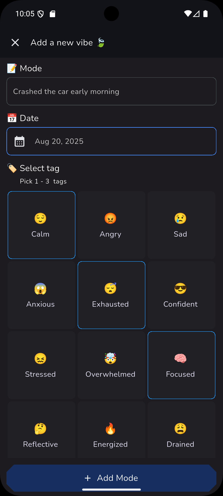

# 🌙 DailyVibe

**DailyVibe** is a simple dark-themed Flutter app that lets you track your daily moods using emojis and tags. Add, delete, and view your vibes grouped by date — all with a clean, minimal UI.

---

## ✨ Features
- Add daily vibes with emoji & tag selection (happy, loved, etc.)
- Delete vibes easily
- Group vibes by date for easy tracking
- Dark theme UI with fallback illustrations
- Simple & intuitive user experience

---

## 🛠 Tech Stack
- **Flutter** (UI framework)
- **Dart** (programming language)
- **StatefulWidgets** for state management
- **Date formatting** with `intl` package

---
## 📸 Screenshots

### 1. Home Screen (Empty State)
Shows the fallback illustration when there are no vibes added yet.

---

### 2. Add Vibe Screen
Form to enter mood details, pick emoji tags, and write a short explanation.

---

### 3. Select Date
Date picker in action when adding a vibe.

---

### 4. Home Screen (Full State)
Vibes displayed and grouped by date in a grid layout.

---

### 5. Deleting a Vibe
Swipe/delete action to remove a vibe from the list.

## 📥 Installation

1. Clone the repo:
   git clone https://github.com/ParwizQattali25/DailyVibe.git
   cd dailyvibe

2. Install dependencies:
    flutter pub get
   
3. Run the app:
    flutter run
